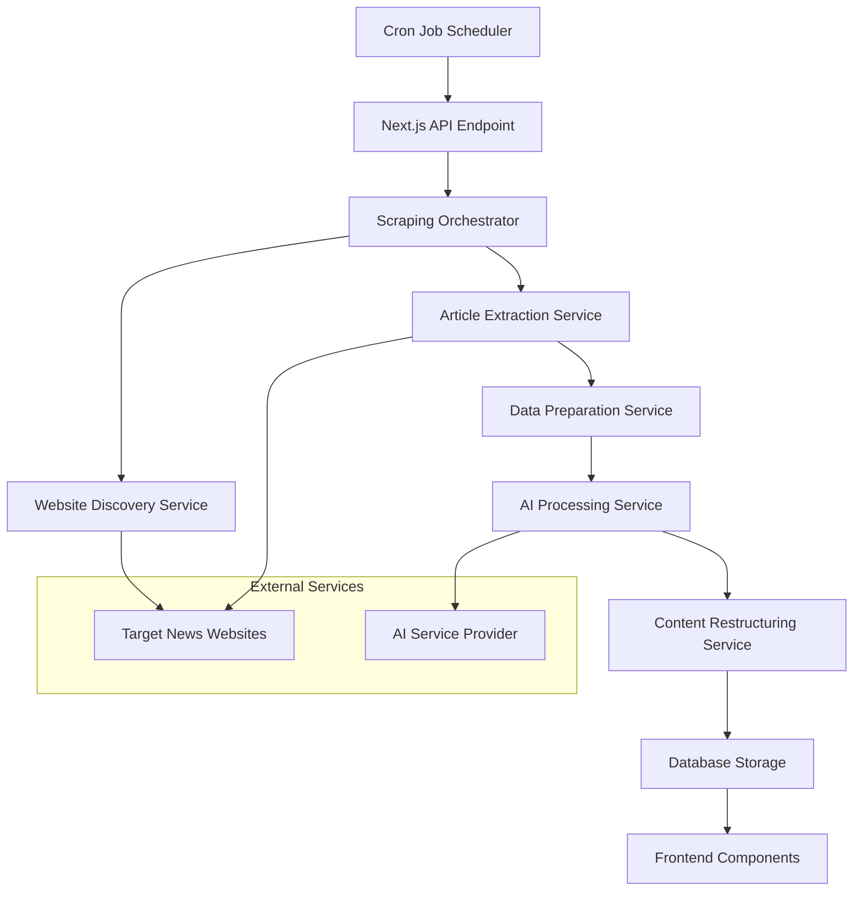
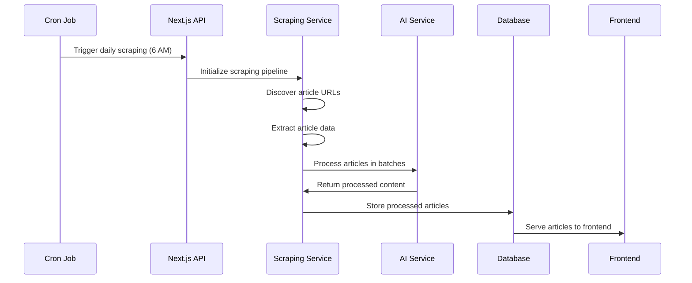

# Design Document

## Overview

The News Scraping & Processing System is a comprehensive automated pipeline that discovers, extracts, processes, and displays Ghanaian political news articles. The system integrates seamlessly with the existing Next.js smart news platform, utilizing Puppeteer for web scraping, AI for content processing, and a scheduled automation system for daily updates.

The architecture follows a modular approach with clear separation of concerns: web scraping, data processing, AI integration, storage, and frontend presentation. The system maintains the existing UI/UX patterns while adding dynamic content capabilities.

## Architecture

### High-Level System Architecture



### Data Flow Architecture



## Components and Interfaces

### 1. Scraping Orchestrator

**Purpose:** Coordinates the entire scraping and processing pipeline

**Interface:**

```typescript
interface ScrapingOrchestrator {
  executeDailyPipeline(): Promise<ScrapingResult>;
  processTargetWebsites(websites: string[]): Promise<Article[]>;
  handleErrors(error: ScrapingError): void;
}

interface ScrapingResult {
  totalArticlesProcessed: number;
  successfulArticles: number;
  failedArticles: number;
  processingTime: number;
  errors: ScrapingError[];
}
```

### 2. Website Discovery Service

**Purpose:** Systematically discovers article URLs from target news websites

**Interface:**

```typescript
interface WebsiteDiscoveryService {
  discoverArticleUrls(baseUrl: string, categories: string[]): Promise<string[]>;
  filterDuplicateUrls(urls: string[]): string[];
  validateArticleUrl(url: string): boolean;
}

interface DiscoveryConfig {
  targetWebsites: string[];
  categoryPages: string[];
  articlePatterns: RegExp[];
  excludePatterns: RegExp[];
}
```

### 3. Article Extraction Service

**Purpose:** Extracts detailed article data from individual URLs using Puppeteer

**Interface:**

```typescript
interface ArticleExtractionService {
  extractArticleData(url: string): Promise<RawArticle>;
  extractImageUrls(page: Page): Promise<string[]>;
  extractMetadata(page: Page): Promise<ArticleMetadata>;
}

interface RawArticle {
  url: string;
  title: string;
  content: string;
  author: string;
  publishDate: string;
  category: string;
  imageUrls: string[];
  metadata: ArticleMetadata;
}

interface ArticleMetadata {
  scrapingTimestamp: Date;
  sourceUrl: string;
  wordCount: number;
  estimatedReadTime: number;
}
```

### 4. AI Processing Service

**Purpose:** Processes scraped articles through AI to create unique content

**Interface:**

```typescript
interface AIProcessingService {
  processBatch(articles: RawArticle[]): Promise<ProcessedArticle[]>;
  rewriteContent(article: RawArticle): Promise<ProcessedContent>;
  generateTags(content: string): Promise<string[]>;
  categorizeArticle(content: string): Promise<string>;
}

interface ProcessedArticle {
  id: string;
  title: string;
  content: string;
  summary: string;
  author: string;
  publishDate: string;
  category: string;
  tags: string[];
  imageUrls: string[]; // Preserved from original
  metadata: ArticleMetadata;
  aiProcessingMetadata: AIMetadata;
}

interface AIMetadata {
  processingTimestamp: Date;
  modelUsed: string;
  confidenceScore: number;
  originalWordCount: number;
  processedWordCount: number;
}
```

### 5. Database Storage Service

**Purpose:** Manages article storage, retrieval, and cleanup operations

**Interface:**

```typescript
interface DatabaseService {
  storeArticles(articles: ProcessedArticle[]): Promise<void>;
  getArticlesByCategory(
    category: string,
    limit?: number
  ): Promise<ProcessedArticle[]>;
  getTrendingArticles(limit?: number): Promise<ProcessedArticle[]>;
  cleanupOldArticles(daysOld: number): Promise<number>;
  getArticleById(id: string): Promise<ProcessedArticle | null>;
}
```

### 6. Frontend Integration Service

**Purpose:** Formats processed articles for frontend consumption

**Interface:**

```typescript
interface FrontendIntegrationService {
  formatForNewsCard(article: ProcessedArticle): NewsCardProps;
  formatForTrendingCard(article: ProcessedArticle): TrendingCardProps;
  generateFallbackImage(category: string): string;
}

// Existing interfaces from current frontend
interface NewsCardProps {
  id: string;
  image: string;
  title: string;
  excerpt: string;
  author: string;
  date: string;
  tag: string;
  readTime: string;
  size?: "small" | "large";
}
```

## Data Models

### Article Storage Schema

```typescript
interface StoredArticle {
  id: string;
  title: string;
  content: string;
  summary: string;
  author: string;
  publishDate: Date;
  scrapingDate: Date;
  category: "Politics" | "Sports" | "Business" | "Entertainment" | "General";
  tags: string[];
  imageUrls: string[];
  sourceUrl: string;
  readTime: number;
  status: "active" | "archived" | "failed";

  // AI Processing metadata
  aiMetadata: {
    processingTimestamp: Date;
    modelUsed: string;
    confidenceScore: number;
    originalWordCount: number;
    processedWordCount: number;
  };

  // Scraping metadata
  scrapingMetadata: {
    sourceWebsite: string;
    scrapingTimestamp: Date;
    extractionMethod: string;
    imageCount: number;
  };
}
```

### Configuration Schema

```typescript
interface SystemConfig {
  scraping: {
    targetWebsites: WebsiteConfig[];
    scheduleTime: string; // "06:00"
    batchSize: number;
    maxArticlesPerRun: number;
    timeoutMs: number;
  };

  ai: {
    provider: string;
    model: string;
    batchSize: number;
    maxTokens: number;
    temperature: number;
  };

  storage: {
    retentionDays: number;
    maxArticlesPerCategory: number;
  };
}

interface WebsiteConfig {
  name: string;
  baseUrl: string;
  categoryPages: string[];
  selectors: {
    articleLinks: string;
    title: string;
    content: string;
    author: string;
    publishDate: string;
    images: string;
  };
}
```

## Error Handling

### Error Classification

```typescript
enum ErrorType {
  NETWORK_ERROR = "network_error",
  PARSING_ERROR = "parsing_error",
  AI_PROCESSING_ERROR = "ai_processing_error",
  DATABASE_ERROR = "database_error",
  VALIDATION_ERROR = "validation_error",
}

interface ScrapingError {
  type: ErrorType;
  message: string;
  url?: string;
  timestamp: Date;
  retryable: boolean;
  context?: Record<string, any>;
}
```

### Error Handling Strategy

1. **Network Errors:** Implement exponential backoff retry mechanism with maximum 3 attempts
2. **Parsing Errors:** Log error details and skip problematic articles, continue with batch
3. **AI Processing Errors:** Retry with smaller batch sizes, fallback to original content if needed
4. **Database Errors:** Implement transaction rollback and retry logic
5. **Validation Errors:** Log validation failures and exclude invalid articles from processing

### Monitoring and Alerting

```typescript
interface MonitoringService {
  logScrapingMetrics(metrics: ScrapingMetrics): void;
  alertOnFailureThreshold(failureRate: number): void;
  trackProcessingTime(duration: number): void;
}

interface ScrapingMetrics {
  totalArticlesAttempted: number;
  successfulArticles: number;
  failedArticles: number;
  averageProcessingTime: number;
  errorsByType: Record<ErrorType, number>;
}
```

## Testing Strategy

### Unit Testing

1. **Scraping Services:** Mock Puppeteer responses and test extraction logic
2. **AI Processing:** Mock AI service responses and test content transformation
3. **Database Operations:** Use in-memory database for testing CRUD operations
4. **Frontend Components:** Test component rendering with mock article data

### Integration Testing

1. **End-to-End Pipeline:** Test complete flow from URL discovery to frontend display
2. **API Endpoints:** Test scraping trigger and article retrieval endpoints
3. **Error Scenarios:** Test system behavior under various failure conditions
4. **Performance Testing:** Validate processing times and resource usage

### Test Data Management

```typescript
interface TestDataFactory {
  createMockArticle(overrides?: Partial<RawArticle>): RawArticle;
  createMockProcessedArticle(
    overrides?: Partial<ProcessedArticle>
  ): ProcessedArticle;
  createMockWebsiteResponse(articleCount: number): string;
}
```

### Testing Configuration

```typescript
interface TestConfig {
  mockWebsites: string[];
  testArticleCount: number;
  aiMockResponses: ProcessedArticle[];
  databaseTestMode: boolean;
  skipExternalServices: boolean;
}
```

## Implementation Considerations

### Performance Optimization

1. **Concurrent Processing:** Process multiple articles simultaneously with controlled concurrency
2. **Caching Strategy:** Cache processed articles and implement smart cache invalidation
3. **Database Indexing:** Index articles by category, date, and tags for fast retrieval
4. **Image Optimization:** Implement lazy loading and responsive images in frontend

### Security Measures

1. **Rate Limiting:** Implement respectful scraping with delays between requests
2. **User Agent Rotation:** Use varied user agents to avoid detection
3. **Data Sanitization:** Sanitize all scraped content before AI processing and storage
4. **API Security:** Secure scraping trigger endpoint with authentication

### Scalability Considerations

1. **Horizontal Scaling:** Design services to be stateless for easy scaling
2. **Queue System:** Implement job queue for handling large volumes of articles
3. **Database Sharding:** Plan for database scaling as article volume grows
4. **CDN Integration:** Use CDN for serving images and static content

### Maintenance and Operations

1. **Configuration Management:** Externalize all configuration for easy updates
2. **Logging Strategy:** Comprehensive logging for debugging and monitoring
3. **Health Checks:** Implement health check endpoints for system monitoring
4. **Backup Strategy:** Regular database backups and disaster recovery planning
